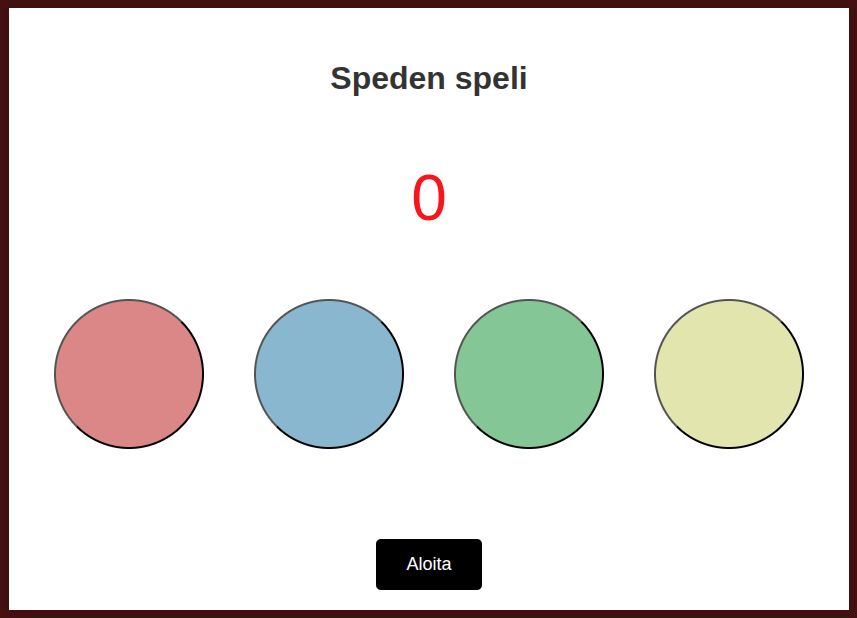

# Tehtävä - Speden speli

Pelin kulku:

- Pelissä on neljä nappia, joissa on valo. 
- Kun peli käynnistyy, yksi satunnainen lamppu syttyy, palaa (esim. 800ms) ja sammuu.
- Pienen viiveen (esim. 800ms) jälkeen uusi satunnainen lamppu syttyy, palaa ja sammuu.
- Lamput jatkavat syttymistä ja sammumista ja niiden järjestys tallentuu muistiin.
- Pelaajan tehtävä on painaa nappeja samassa järjestyksessä kuin lamput ovat syttyneet.
- Jokaisesta oikeasta napista pelaajan pisteet kasvavat yhdellä.
- Jos pelaaja painaa väärää nappia, peli päättyy välittömästi.
- Pisteet näkyvät koko pelin ajan ja pelin päätyttyä ne jäävät näkyviin.

Voit halutessa vielä lisätä:

- Vaikeusasteet (lyhyempi palo- ja viiveaika = vaikeampi)
- Visuaalinen palaute (animaatio) oikeasta tai väärästä valinnasta

Rautalankamalli:

 